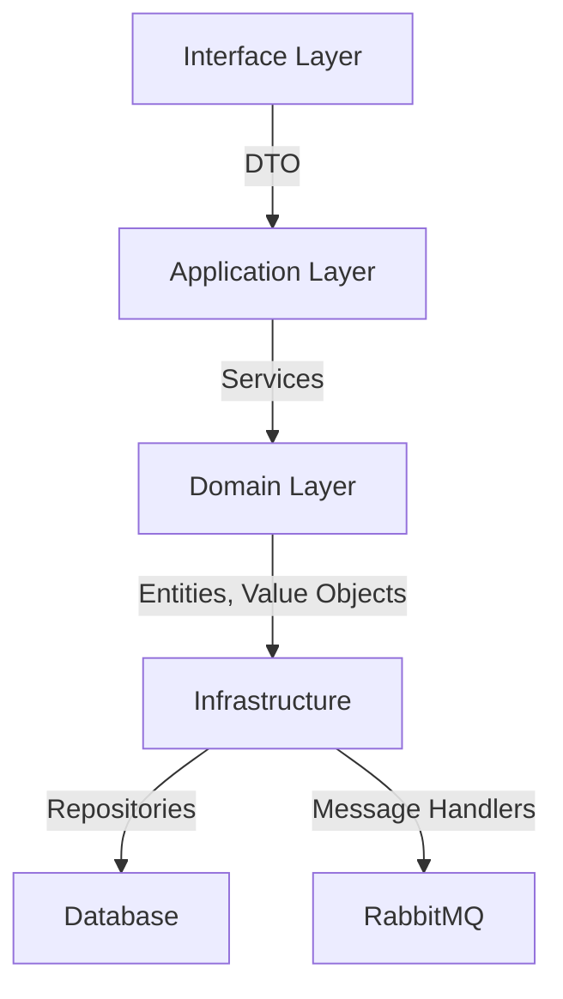

# Защита проекта "Сервис подбора преподавателей"

## Цель и задачи проекта

Цель: Разработка сервиса для эффективного управления образовательным процессом с учетом навыков преподавателей и студентов

Задачи:
1. Реализация системы управления учебными группами с учетом:
   - Ограничений по количеству студентов
   - Требуемых навыков для группы
   - Доступности преподавателей
2. Создание API для управления:
   - Профилями преподавателей и студентов
   - Составом учебных групп
   - Навыками участников
3. Обеспечение надежности системы через:
   - Асинхронную обработку операций
   - Валидацию входных данных
   - Логирование действий

## Использованные технологии

1. Backend:
   - PHP 8.2, Symfony 6.3
   - PostgreSQL (с оптимизированными индексами)
   - RabbitMQ для асинхронной обработки
   - Redis для кеширования

2. Архитектура:
- **Domain-Driven Design (DDD)**:
   - Interface Layer (Controllers, Forms, DTOs)
   - Application Layer (Commands, Services)
   - Domain Layer (Entities, Repositories)
   - Infrastructure Layer (MessageHandlers, Persistence)
- **Domain-Driven Design**: 
   - Выделение бизнес-логики в отдельный слой
   - Использование Value Objects (EntityId, Email)
   - Работа с доменными событиями
- **Асинхронная обработка**:
   - Отложенная обработка тяжелых операций
   - Система очередей на RabbitMQ
   - Обработка ошибок с логированием

3. DevOps:
   - **Docker**: Контейнеризация приложения и зависимостей
   - **Symfony Debug**: Отладка и профилирование
   - **Monolog**: Система логирования

## Что получилось

### Архитектура проекта

Основные сущности:
   Teacher (преподаватель)
   Student (студент)
   Group (учебная группа)
   Skill (навык)
   SkillProficiency (уровень владения навыком)
Взаимодействие компонентов:
   REST API для внешних запросов
   RabbitMQ для асинхронных операций
   Doctrine ORM для работы с БД
   Symfony Security для авторизации

Технические детали
База данных:
   PostgreSQL с оптимизированными индексами
   Связи между таблицами через foreign keys
   Составные индексы для частых запросов
Асинхронная обработка:
   Отдельные очереди для разных типов сообщений
   Механизм повторных попыток при ошибках
   Очистка ресурсов после обработки
Безопасность:
   JWT авторизация для API
   Валидация входных данных
   Разграничение прав доступа

### Основные компоненты

1. **TeacherService**:
   - Управление профилями преподавателей (CRUD операции)
   - Управление навыками преподавателей
   - Асинхронные уведомления об изменениях через RabbitMQ

2. **GroupService**:
   - Создание и управление учебными группами
   - Контроль ограничений по размеру групп
   - Управление составом группы (студенты, преподаватель)
   - Отслеживание навыков группы

3. **StudentService**:
   - Управление профилями студентов
   - Управление навыками студентов
   - Присоединение/отсоединение от групп
   - Отслеживание прогресса обучения

4. **Система обработки сообщений**:
   - Асинхронная обработка операций через RabbitMQ
   - Надежная доставка сообщений с повторными попытками
   - Логирование ошибок обработки
   - Очистка ресурсов после обработки (Doctrine clear)

### Метрики и мониторинг
- Логирование всех важных операций
- Отслеживание ошибок обработки сообщений
- Мониторинг состояния очередей

## Выводы

1. Реализованы ключевые функции:
   - Управление преподавателями, студентами и группами
   - Асинхронная обработка длительных операций
   - Надежная работа с данными через ORM

2. Технические достижения:
   - Четкое разделение на слои архитектуры
   - Надежная обработка ошибок с логированием
   - Асинхронная обработка тяжелых операций

3. Время работы над проектом: 3 месяца
4. Оценка полезности проекта: 9/10

## Планы по развитию

1. Технические улучшения:
   - Внедрение Machine Learning для подбора
   - Горизонтальное масштабирование
   - Real-time аналитика

2. Функциональные улучшения:
   - Расширенная аналитика для администраторов
   - Интеграция с LMS системами
   - Мобильное приложение
